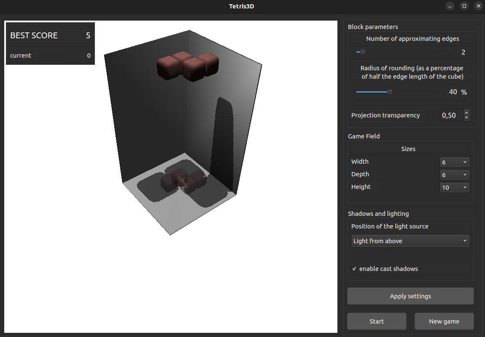

# tetris3D 

## Features

* From scratch (no unity or other frameworks)
* Real-time rendering using a z-buffer with shadows and transparency

## Examples


If that's not enough for you, you can change cubes to spheres.


or move the light source up...



[more examples](./examples/)

## User interface

### Game
* Rotate the block using the keys W-S, A-D, Q-E
* Quick landing using the Space key
* Move the block using the arrows
* Rotate the game field using the mouse right button

### Graphics

You can configure
* number of approximating edges
* radius of rounding for cubes
* the size of the playing field
* location of the light source
* shadows

## How to use?

Requirements:

* Qt6
* OpenMP (for parallel processing)

Build and launch:

```bash
git clone git@github.com:hahaclassic/tetris3D.git

cd ./tetris3D

make build

./tetris3D
```

or

```bash
git clone git@github.com:hahaclassic/tetris3D.git

cd ./tetris3D/code

cmake .

make

./tetris3D
```

To delete all side files created during the build:

```bash
make clear
```

## FAQ

### If it doesn't work when running from VSCode terminal on Ubuntu?


> Most likely, you installed VSCode from Snap, the snap version has some problems with system calls. Try to run from the standard terminal provided by ubuntu

Steps:
1. Ctrl + Alt + T
2. Switch directory to tetris3D
3. Run tetris3D

---

### It doesn't build?

Try

```bash
chmod +x ./scripts/build.sh
```
